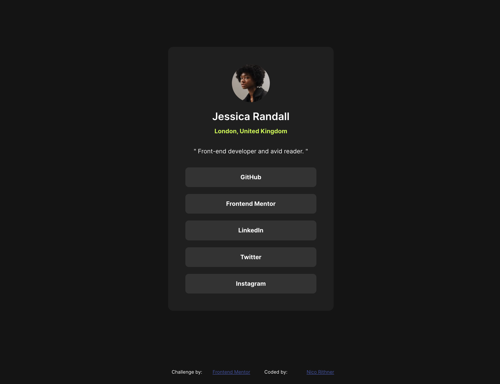
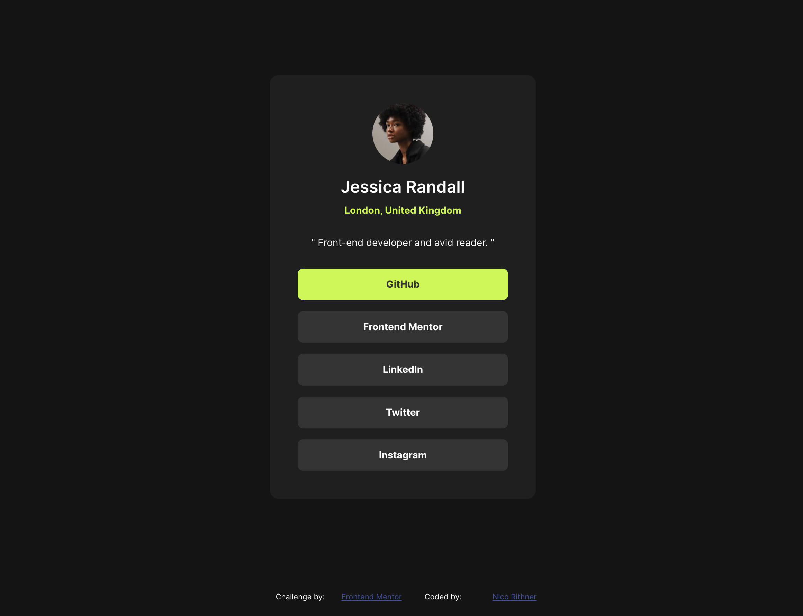
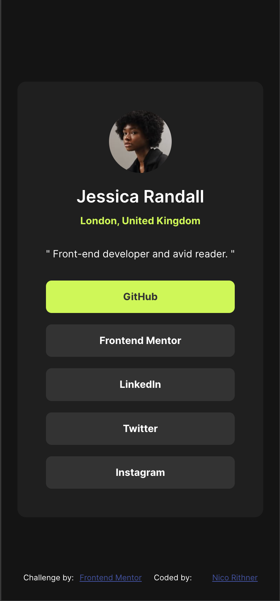

# Frontend Mentor - Social links profile solution

This is a solution to the [Social links profile challenge on Frontend Mentor](https://www.frontendmentor.io/challenges/social-links-profile-UG32l9m6dQ). Frontend Mentor challenges help you improve your coding skills by building realistic projects.

## Table of contents

- [Overview](#overview)
  - [The challenge](#the-challenge)
  - [Screenshot](#screenshot)
  - [Links](#links)
- [My process](#my-process)
  - [Built with](#built-with)
  - [Continued development](#continued-development)

## Overview

### The challenge

Users should be able to:

- View the optimal layout for the interface depending on their device's screen size

### Screenshots

#### Desktop View

  

    
  

#### Desktop Active View

  

    
  

#### Mobile View

  

    
  

### Links

- Live Site URL: [github page](https://nicorithner.github.io/solution-social-links-profile-main/)

## My process

### Built with

- [React](https://reactjs.org/) - JS library
- [Vite](https://vitejs.dev/) - A build tool that aims to provide a faster and leaner development experience for modern web projects.
- [TypeScript](https://www.typescriptlang.org/) - TypeScript is a strongly typed programming language that builds on JavaScript
- [SASS](https://sass-lang.com/) - For styles
- [Figma](https://www.figma.com/) - Figma, as design source

### Continued development

I may comeback to this project to add tests.
